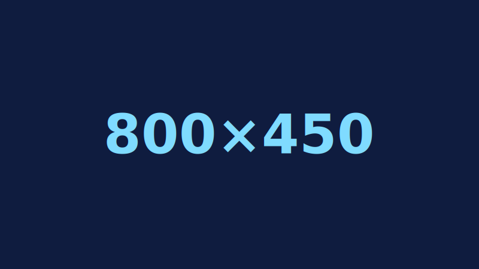

# The Plan For My Website Project

<!-- USE THIS TEMPLATE TO PLAN YOUR PROJECT - REMEMBER TO "COMMIT" YOUR CHANGES TO THIS FILE! FEEL FREE TO CHANGE ANYTHING OR ADD ANY SECTIONS THAT YOU NEED TO HELP YOU TO PLAN THE PROJECT -->

<!-- INSTRUCTIONS: https://vuxcode.netlify.app/new/we1/lessons/major-project-brief/ -->

## Idea

This is my website idea...

<!-- INSERT YOUR EXPLANATION FOR YOUR IDEA HERE -->

## Budget

This is how I will use my 30 hours on this project...

<!-- INSERT A PLAN FOR HOW YOU ARE GOING TO USE THE TIME LIMIT. TRY TO BREAK THE WHOLE WEBSITE DOWN INTO SMALLER TASKS -->

## Sketches

I've included some drawings in the repository for what I think the webite will look like and how it will work.

<!-- INSERT YOUR IMAGES IN THE REPOSITORY + OPTIONAL: COPY THE SYNTAX ABOVE TO ADD YOUR OWN IMAGES IN "MARKDOWN" -->

## Inspiration

I am inspired by the following sources...

<!-- INCLUDE AT LEAST 3 EXAMPLES WITH SCREENSHOTS AND LINKS. EXPLAIN THE REASONS WHY YOU LIKE THE DESIGN OR THE USER EXPERIENCE -->

## Promises

1. ???

<!-- WRITE A LIST OF PROMISES FOR WHAT THE USER SHOULD BE ABLE TO DO ON THE WEBSITE; BE OPEN AND HONEST! WHAT DO YOU THINK YOU CAN DO BEFORE THE DEADLINE -->

## The User Will Not Be Able To Do The Following Things

1. ???

<!-- MAKE SUGGESTIONS FOR WHAT THE USER WILL NOT BE ABLE TO DO ON THE WEBSITE. WHAT MIGHT A CLIENT OR A USER EXPECT TO DO WITH ON YOUR WEBSITE THAT YOU DON'T THINK WILL BE POSSIBLE TO DO BEFORE THE FINAL DEADLINE. WRITE A CLEAR LIST OF THINGS -->
